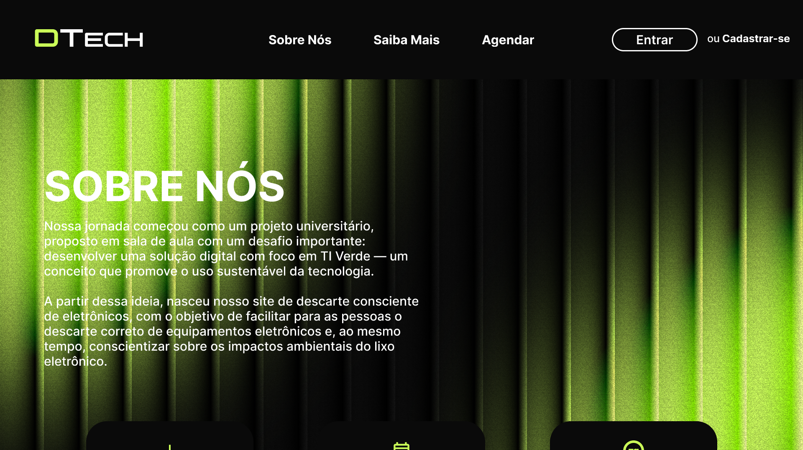

<h1 align="center">
  <strong>DTech - Descarte de Lixo Eletrônico</strong> 
</h1>

  

## 🚀 Tecnologias

  

## 📔 Conhecimentos adquiridos/praticados

- [x] Uso semântico do HTML
- [x] Aprendendo sobre o framework TailwindCSS
- [x] Manipulação de estrutura do HTML com Javascript (DOM)
